# Modal Whisper ACFT Fine-Tuning


Run Whisper ACFT (Adapter-based Continuous Fine-Tuning) on [Modal](https://modal.com) with A100 GPUs.

ACFT trains Whisper models to handle variable-length audio context, enabling better performance in apps like FUTO Voice Input that process audio clips shorter than 30 seconds.

Based on: https://github.com/futo-org/whisper-acft

## Setup

1. Install Modal CLI and authenticate:
   ```bash
   pip install modal
   modal token new
   ```

2. Create a Modal secret named `huggingface-token` with your HF token (needs write access)

3. Update `modal_acft.py`:
   - Set `DATASET_NAME` to your Hugging Face dataset (needs `audio` and `text`/`sentence` columns)
   - Update the `default_repo` values in the model configs to your HF repos

## Usage

Train any Whisper variant:

```bash
# Tiny (fastest)
modal run modal_acft.py::tiny_acft_app

# Base
modal run modal_acft.py::base_acft_app

# Small
modal run modal_acft.py::small_acft_app

# Medium
modal run modal_acft.py::medium_acft_app
```

Models are automatically pushed to your Hugging Face repo as private models.

## Configuration

Edit defaults in `modal_acft.py`:
- `DEFAULT_EPOCHS`: Training epochs (default: 8)
- `DEFAULT_LR`: Learning rate (default: 1e-6)
- `DEFAULT_MAX_AUDIO_LENGTH`: Max audio length in seconds (default: 29.0)

## Converting to GGML for FUTO Voice Input

After training, you'll have a model in safetensors format on Hugging Face. To use it with [FUTO Voice Input](https://keyboard.futo.org/voice-input-models) or other whisper.cpp-based apps, you need to convert it to GGML format.

### Prerequisites

1. **whisper.cpp** with conversion scripts:
   ```bash
   git clone https://github.com/ggml-org/whisper.cpp.git
   ```

2. **OpenAI Whisper repository** (required for `mel_filters.npz`):
   ```bash
   git clone https://github.com/openai/whisper.git
   ```

3. **Python dependencies**:
   ```bash
   pip install safetensors torch numpy
   ```

### Conversion Command

The `convert-safetensors-to-ggml.py` script takes three arguments:

```bash
python3 convert-safetensors-to-ggml.py \
  /path/to/model/directory \
  /path/to/openai/whisper \
  /path/to/output/directory
```

**Arguments:**
1. Model directory containing `model.safetensors`, `config.json`, and `vocab.json`
2. Path to OpenAI Whisper repo (for mel filters)
3. Output directory for the GGML model

### Example

```bash
# Download your model from HuggingFace
git clone https://huggingface.co/YOUR_USERNAME/whisper-acft-base

# Create output directory
mkdir -p whisper-acft-base/ggml

# Convert
python3 /path/to/whisper.cpp/models/convert-safetensors-to-ggml.py \
  ./whisper-acft-base \
  /path/to/whisper \
  ./whisper-acft-base/ggml
```

This produces `ggml-model.bin` in f16 precision (~142 MB for base model).

### For f32 Output

Add any fourth argument for full 32-bit precision (larger file):

```bash
python3 convert-safetensors-to-ggml.py ./model /path/to/whisper ./output use-f32
```

### Quantization (Optional)

Reduce model size for mobile devices:

```bash
# Build whisper.cpp
cd whisper.cpp && make

# Quantize (q5_0 is a good balance of size/quality)
./quantize models/ggml-model.bin models/ggml-model-q5_0.bin q5_0
```

Available quantization types: `q4_0`, `q4_1`, `q5_0`, `q5_1`, `q8_0`

### Using with FUTO Voice Input

1. Transfer `ggml-model.bin` to your Android device
2. Rename to something descriptive (e.g., `my-custom-whisper-base.bin`)
3. Open FUTO Voice Input → Settings → Models → Import custom model
4. Select the `.bin` file

### Expected Directory Structure

```
your_model/
├── model.safetensors      # Original HuggingFace format
├── config.json
├── vocab.json
├── tokenizer.json
└── ggml/
    └── ggml-model.bin     # Converted GGML format
```

### Important Notes for FUTO

- Only **tiny**, **base**, and **small** models are supported (large models are too big for mobile)
- ACFT fine-tuning (which this script produces) is **required** for proper short-audio handling
- Without ACFT, short dictations (<15s) may exhibit infinite repetition or delays
- GGML format is also compatible with whisper.cpp for desktop inference

### Troubleshooting

**KeyError: 'dims' or 'max_length'**: Your `config.json` may be missing required fields. Ensure it has `max_length` or `max_target_positions`.

**Model produces garbage output**: Verify you're using a model size supported by FUTO. Also check that mel filters from the OpenAI Whisper repo are accessible.

**Script not found**: Conversion script names vary by whisper.cpp version. Check the `models/` directory for available scripts (`convert-safetensors-to-ggml.py`, `convert-hf-to-ggml.py`, `convert-pt-to-ggml.py`).

### References

- [whisper.cpp](https://github.com/ggml-org/whisper.cpp) - GGML implementation of Whisper
- [FUTO Voice Input Models](https://github.com/futo-org/voice-input-models) - Compatible model requirements
- [Safetensors Conversion Guide](https://casadelkrogh.dk/2025/02/whisper.cpp-safetensors-conversion/) - Detailed conversion walkthrough

---

## Process Overview (Screenshots)

### Why ACFT?

**Important:** If you fine-tune Whisper using standard methods, you will get repetition loops on any audio shorter than 30 seconds. This is because Whisper was trained on 30-second audio chunks and doesn't handle variable-length audio well out of the box.

ACFT (Adapter-based Continuous Fine-Tuning) from [FUTO's whisper-acft repo](https://github.com/futo-org/whisper-acft) specifically addresses this by training the model to handle variable audio lengths. This Modal script is simply a cloud template to run ACFT training—you can also run it locally if you have the hardware.

### The Full Pipeline

1. **Train with ACFT** (Modal or local) → Produces safetensors model on Hugging Face
2. **Download safetensors** from your Hugging Face repo
3. **Convert to GGML** for whisper.cpp inference on device

### Training on Modal

Running the ACFT training job on Modal with A100 GPUs:

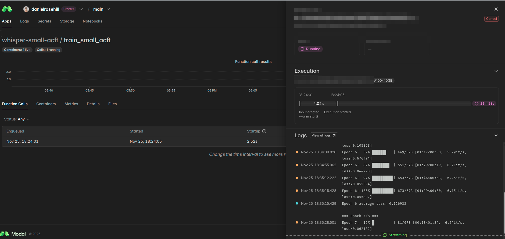

Training logs showing epoch progress:

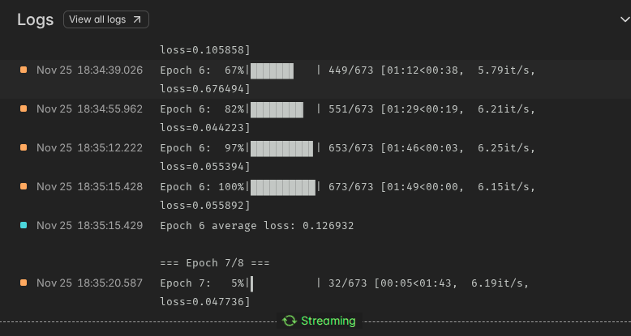

### Hugging Face Output

After training completes, your model files (including `model.safetensors`) are pushed to your Hugging Face repo:

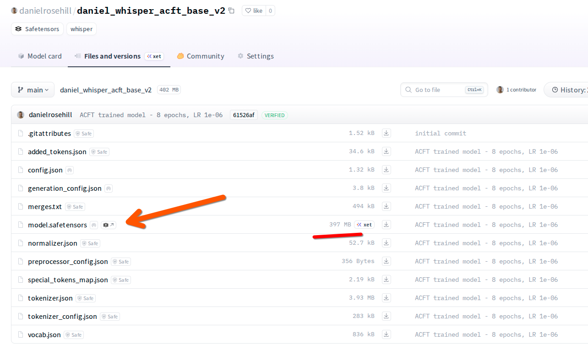

### Deployment to Android (FUTO Voice Input)

After converting to GGML format, transfer the model to your Android device.

ACFT models vs non-ACFT—note the naming convention to distinguish them:

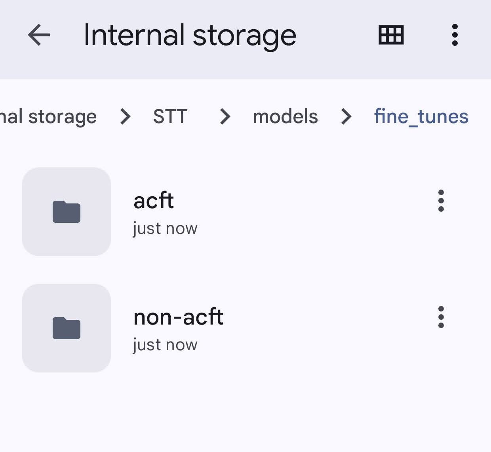

The converted GGML model file (~148MB for base):

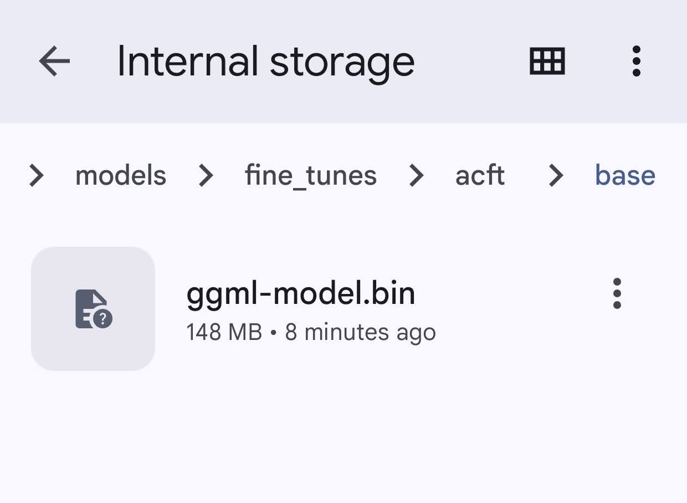

Comparing model sizes (base vs tiny):

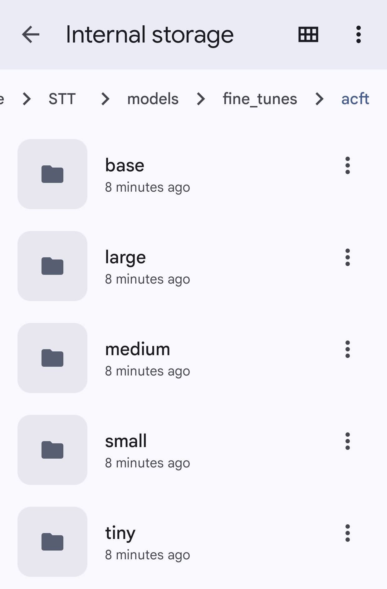

Importing the custom voice model and selecting language:

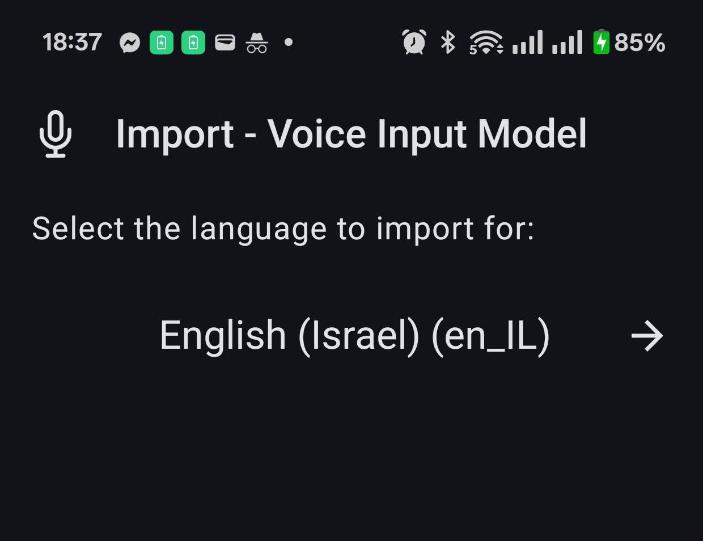

Replacing an existing model with your fine-tuned version:

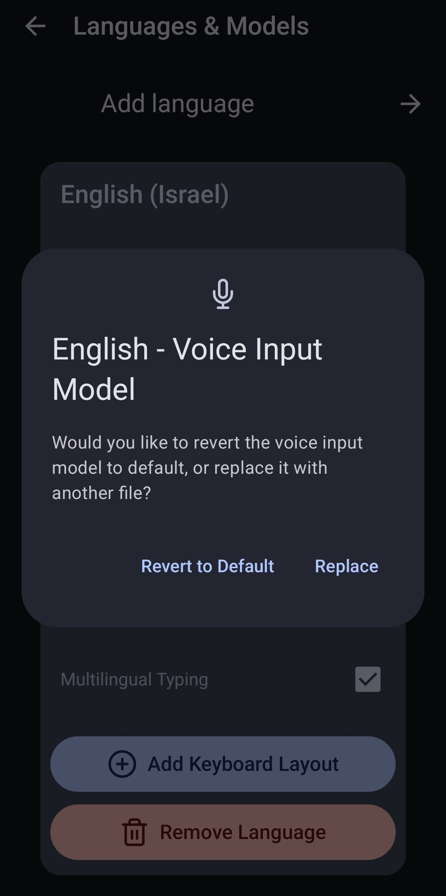

Configuration in FUTO Voice Input settings:

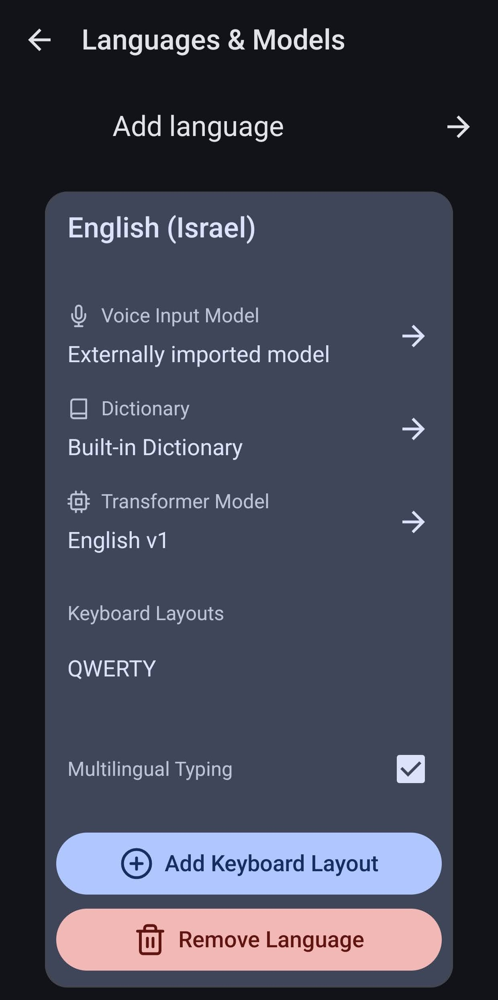

### Testing the Fine-Tuned Model

Testing recognition of domain-specific terms:

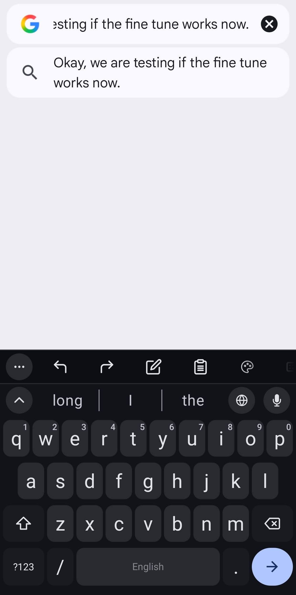

Successful recognition of technical terms like "GitHub":

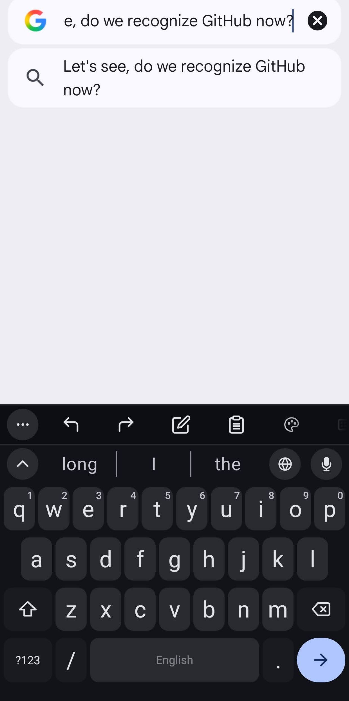
